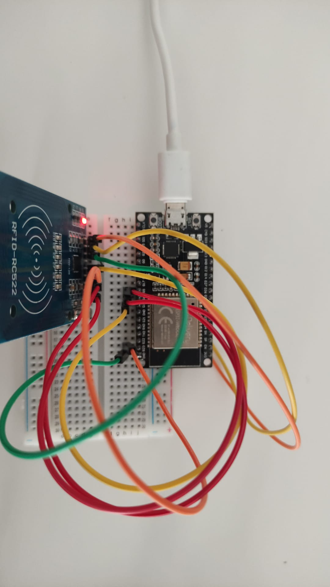

# PRACTICA 6  : Buses de comunicación II (SPI)

## B:  LECTURA DE ETIQUETA RFID

### Código

```cpp
#include <SPI.h>
#include <MFRC522.h>

#define RST_PIN 9 //Pin 9 para el reset del RC522
#define SS_PIN 10 //Pin 10 para el SS (SDA) del RC522
MFRC522 mfrc522(SS_PIN, RST_PIN); //Creamos el objeto para el RC522

void setup() {
  Serial.begin(9600); //Iniciamos la comunicación serial
  SPI.begin(); //Iniciamos el Bus SPI
  mfrc522.PCD_Init(); // Iniciamos el MFRC522
  Serial.println("Lectura del UID");
}

void loop() {
  // Revisamos si hay nuevas tarjetas presentes
  if ( mfrc522.PICC_IsNewCardPresent())
    {
    //Seleccionamos una tarjeta
      if ( mfrc522.PICC_ReadCardSerial())
      {
          // Enviamos serialemente su UID
          Serial.print("Card UID:");
          for (byte i = 0; i < mfrc522.uid.size; i++) {
            Serial.print(mfrc522.uid.uidByte[i] < 0x10 ? " 0" : " ");
            Serial.print(mfrc522.uid.uidByte[i], HEX);
          }
          Serial.println();
          // Terminamos la lectura de la tarjeta actual
          mfrc522.PICC_HaltA();
      }
    }
}
```

### Funcionamiento del programa

En primer lugar, tenemos que agregar dos librerías por un lado "SPI.h" para poder comunicarnos con dispositivos SPI y también haremos uso de "MFRC522.h" que nos permite leer la tarjeta RFID. A continuación debemos especificar los pines Reset y SDA del módulo. 

```cpp
#include <SPI.h>
#include <MFRC522.h>

#define RST_PIN 9 //Pin 9 para el reset del RC522
#define SS_PIN 10 //Pin 10 para el SS (SDA) del RC522
MFRC522 mfrc522(SS_PIN, RST_PIN); //Creamos el objeto para el RC522

```

A continuación definimos nuestra función Setup, en primer lugar iniciamos el puerto serie. Luego iniciamos el bus SPI y llamamos a la función mfrc522.PCD_Init(). Esta se encarga de iniciar y configurar el RC522 para su lectura. Finalmente hacemos una impresión por pantalla.

```cpp

void setup() {
  Serial.begin(9600); //Iniciamos la comunicación serial
  SPI.begin(); //Iniciamos el Bus SPI
  mfrc522.PCD_Init(); // Iniciamos el MFRC522
  Serial.println("Lectura del UID");
}
```

Finalmente nos encontramos con el bloque Loop, en primer lugar vamos a revisar si se ha leído la tarjeta RFID correctamente con la sentencia "mfrc522.PICC_IsNewCardPresent()". En la siguiente sentencia, "mfrc522.PICC_ReadCardSerial()" nos devuelve si ha podido seleccionar una tarjeta RFID para poder trabajar con ella. Si esta sentencia nos retorna True, es decir que ha encontrado una tarjeta, creamos un bucle For para imprimir por pantalla el código de identificación y finalmente cerramos la lectura de la tarjeta RFID.

```cpp
void loop() {
  // Revisamos si hay nuevas tarjetas presentes
  if ( mfrc522.PICC_IsNewCardPresent())
    {
    //Seleccionamos una tarjeta
      if ( mfrc522.PICC_ReadCardSerial())
      {
          // Enviamos serialemente su UID
          Serial.print("Card UID:");
          for (byte i = 0; i < mfrc522.uid.size; i++) {
            Serial.print(mfrc522.uid.uidByte[i] < 0x10 ? " 0" : " ");
            Serial.print(mfrc522.uid.uidByte[i], HEX);
          }
          Serial.println();
          // Terminamos la lectura de la tarjeta actual
          mfrc522.PICC_HaltA();
      }
    }
}
```

### Foto del Montaje 



